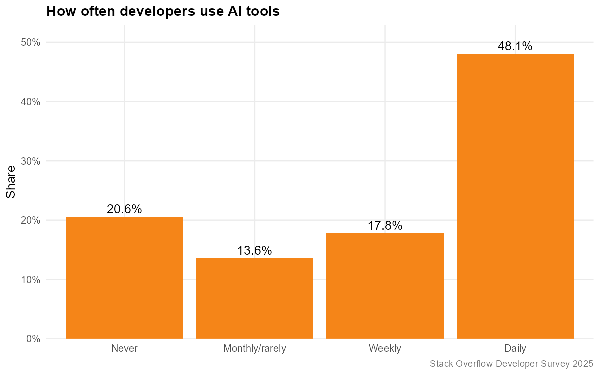
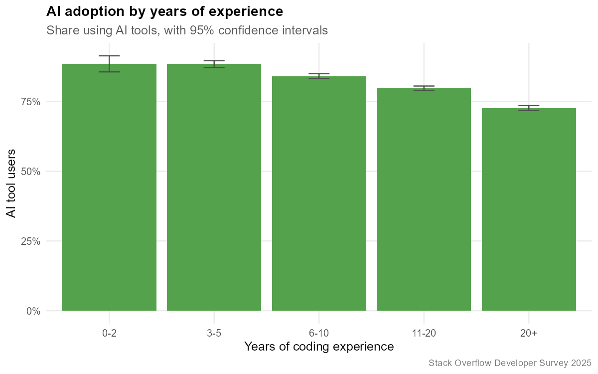
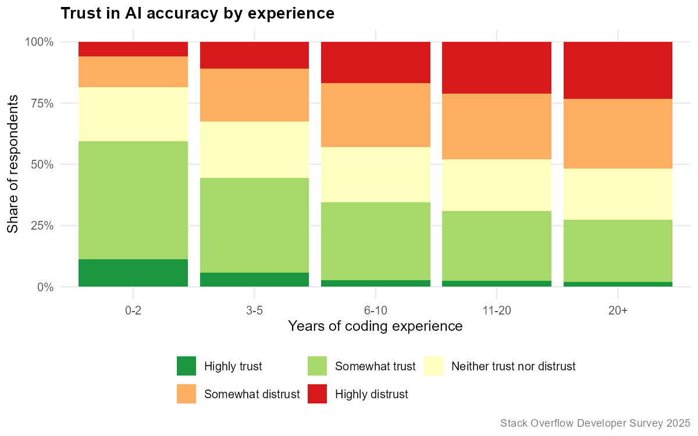
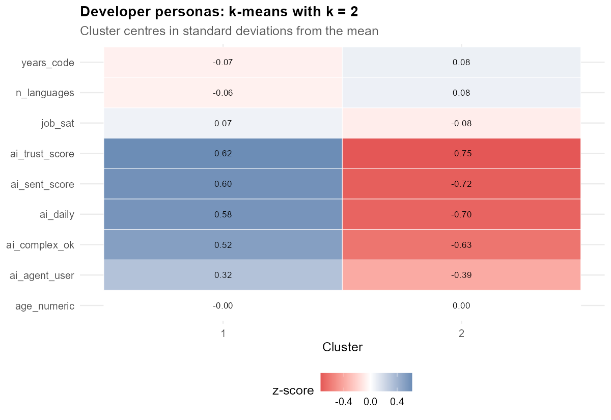

# Do developers trust AI? Adoption, attitudes and pay

A complex data analysis in **R** of the
[Stack Overflow Annual Developer Survey 2025](https://survey.stackoverflow.co/)
— 49,191 raw responses, 172 columns, 44,682 professional developers after
cleaning, from 175 countries.

The project covers the full analysis pipeline: cleaning and feature
engineering, exploratory analysis, hypothesis testing with effect sizes,
regression with diagnostics, supervised machine learning with cross-validation,
and unsupervised clustering — ending in a rendered R Markdown report.

**Report:** [`reports/final_report.html`](reports/final_report.html)
(open it in a browser after cloning).

---

## Research questions

| # | Question | Method |
|---|----------|--------|
| RQ1 | Does AI tool adoption depend on developer role and experience? | Chi-square test, logistic regression |
| RQ2 | Do AI users earn more than non-users? | Welch t-test, Wilcoxon, linear regression |
| RQ3 | Does trust in AI accuracy change with experience? | Chi-square, test for trend in proportions |
| RQ4 | Can AI adoption be predicted from professional attributes? | Logistic regression vs random forest |
| RQ5 | Are there distinct developer "personas" in AI attitudes? | PCA, k-means |

## Key findings

1. **Adoption is near-universal; trust is not.** 79.4% of professional
   developers use AI tools and 48.1% use them daily, but only **32.4% trust
   the accuracy** of what those tools produce.
2. **Adoption and trust both fall with experience.** Adoption drops from
   **88.5%** (0–2 years of experience) to **72.7%** (20+ years); the chi-square
   test for trend is significant at p < 0.001 (Cramer's V = 0.124 for trust).
3. **AI users earn slightly *less*, not more** — median $76,097 vs $81,685
   (Welch t on log salary, p < 0.001, **Cohen's d = −0.16**, a small effect).
   The direction is the opposite of the popular assumption, and the effect is
   explained by experience and region rather than by AI use.
4. **Pay is driven by geography, experience and education.** The linear model
   on log(salary) reaches **R² = 0.443**; a doctorate is worth about +49% over
   no degree (Tukey HSD, p < 0.001), while AI use adds almost nothing.
5. **Adoption is hard to predict.** Logistic regression reaches **AUC 0.663**
   (5-fold CV) and the random forest 0.638 — both beat chance, neither is
   decisive. Adoption is driven by factors the survey does not capture.
6. **The complaint is precision, not capability.** 67% name *"AI solutions that
   are almost right, but not quite"* as their main frustration and 46% say
   debugging AI-generated code costs more time than it saves. Asked which
   skills survive better AI, the free-text answers converge on understanding,
   problem solving, architecture and debugging — judgement, not typing.
7. **Two clear camps.** k-means (k chosen by silhouette) splits developers into
   an **AI-embracing** cluster (54.5%, 87% daily users, mean trust 3.5/5) and a
   **sceptical** cluster (45.5%, 24% daily users, mean trust 2.0/5). The
   sceptics have the higher median salary — $83,668 vs $73,686 — even though
   salary was never used to build the clusters (Kruskal-Wallis p < 2e-16).

| | |
|---|---|
|  |  |
|  |  |

## How to run

Requires **R ≥ 4.3**. From the project root:

```bash
Rscript scripts/00_setup.R     # installs packages, downloads the data (~141 MB)
Rscript scripts/run_all.R      # runs every step and renders the report
```

Or step by step:

```bash
Rscript scripts/01_data_cleaning.R      # raw CSV  -> data/processed/survey_clean.rds
Rscript scripts/02_eda.R                # 12 figures, 8 summary tables
Rscript scripts/03_statistical_tests.R  # 7 hypothesis tests, Holm-adjusted
Rscript scripts/04_modeling.R           # lm + diagnostics, glm vs random forest
Rscript scripts/05_clustering.R         # PCA + k-means personas
```

Every script is independent and reads what the previous one wrote, so any step
can be re-run on its own. `SEED = 42` is set in `R/setup.R`, so splits, folds
and cluster assignments reproduce exactly.

## Repository layout

```
ai-dev-survey-analysis/
├── R/                        # reusable functions, sourced by the scripts
│   ├── setup.R               #   packages, paths, plot theme, seed
│   ├── cleaning.R            #   recoding, feature engineering, outlier rules
│   └── stats.R               #   effect sizes, ROC-AUC, threshold tuning
├── scripts/                  # the analysis pipeline, run in order
│   ├── 00_setup.R            #   install packages + download raw data
│   ├── 01_data_cleaning.R
│   ├── 02_eda.R
│   ├── 03_statistical_tests.R
│   ├── 04_modeling.R
│   ├── 05_clustering.R
│   └── run_all.R
├── data/
│   ├── raw/                  # downloaded CSVs (not committed, see its README)
│   ├── processed/            # survey_clean.rds / .csv (regenerated)
│   └── sample/               # 500-row sample of the cleaned data (committed)
├── outputs/
│   ├── figures/              # 22 PNGs
│   ├── tables/               # 22 CSV result tables
│   └── models/               # fitted model objects (not committed)
└── reports/
    ├── final_report.Rmd
    └── final_report.html
```

## Methods in detail

**Cleaning** (`01_data_cleaning.R`). 172 raw columns are narrowed to the 26
the analysis uses. `YearsCode` is text (because of "Less than 1 year" and
"More than 50 years") and becomes numeric; `Age` buckets become midpoints;
education (8 levels), organisation size (9) and country (175) collapse to 4, 3
and 6 categories so that tests have adequate cell counts. Salaries below
$1,000 or above the 99th percentile are **flagged, not deleted**, and modelling
uses `log(salary)` because the distribution is log-normal. Semicolon-separated
multi-select columns are split with `separate_rows()` and also summarised as
breadth counts. The sample is restricted to people who code professionally.

**Inference** (`03_statistical_tests.R`). Seven tests across five hypothesis
families: chi-square with Cramer's V, Welch t-test with Cohen's d and a
Wilcoxon robustness check, one-way ANOVA with eta-squared plus Tukey HSD, and a
chi-square test for trend. Assumptions are checked explicitly (Shapiro-Wilk,
variance ratio test, minimum expected cell counts) and p-values are
**Holm-adjusted** across the family.

**Modelling** (`04_modeling.R`). A linear model on log(salary) with residual,
Q-Q and VIF diagnostics; then logistic regression against a random forest for
predicting AI adoption, compared on a stratified 75/25 split *and* 5-fold
cross-validated AUC. Because 81% of respondents are AI users, the decision
threshold is tuned on the training set with Youden's J instead of being left at
0.5 — otherwise both models simply predict the majority class.

**Clustering** (`05_clustering.R`). PCA on the standardised AI-attitude and
experience features, k chosen by average silhouette width with an elbow plot as
a cross-check, then k-means with 50 restarts. Salary, region, remote work and
organisation size are deliberately **excluded** from the features and used
afterwards to validate that the clusters mean something.

## Limitations

* Self-selected sample of Stack Overflow visitors, skewed towards North America
  and Europe — this does not generalise to all developers.
* Cross-sectional data: every result is an association, never a causal effect.
  AI users earning less is a property of who adopts AI, not an effect of AI.
* `ConvertedCompYearly` is self-reported and exchange-rate dependent.
* Collapsing 175 countries into 6 regions loses real variation; it buys models
  that fit and tests with adequate cell counts.
* With n in the tens of thousands, nearly everything is statistically
  significant, so effect sizes carry the interpretation.

## Data source and licence

Stack Overflow Annual Developer Survey 2025 — <https://survey.stackoverflow.co/>,
released under **CC BY-SA 4.0**. The raw files are downloaded by
`scripts/00_setup.R` (see [`data/raw/README.md`](data/raw/README.md)) and are
not committed because the main CSV is ~141 MB.

Analysis code in this repository: MIT.
